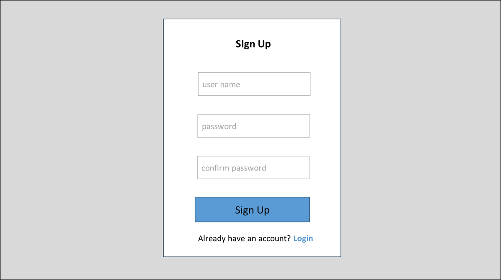

# UI仕様 - 01 登録ページ (Sign Up)

**Version**: 1.0

## ページ概要
新規ユーザーがアカウントを作成するページ

## ページレイアウト
**UI仕様書.xlsx | 01_登録** に参照  


## フォーム要素

| フィールド | 型 | 必須 | バリデーション | エラー時 |
|-----------|-----|------|----------|----------|
| ユーザー名 | text | ✓ | 6文字以上、一意 | "ユーザー名は既に使用されています" |
| パスワード | password | ✓ | 6文字以上 | "パスワードは6文字以上である必要があります" |
| フルネーム | text | ✓ | 空白チェック | "フルネームは必須です" |

## ボタン仕様

| ボタン | 状態 | 効果 |
|--------|------|------|
| 登録する | 通常 | フォーム送信 |
| 登録する | ホバー | 背景色変更 |
| 登録する | 送信中 | 無効化、ローディング表示 |

## バリデーション

### クライアント側
- ユーザー名: 6文字以上、英数字・アンダースコア・ハイフンのみ
- パスワード: 6文字以上
- フルネーム: 空白チェック

### サーバー側
- ユーザー名の一意性チェック
- パスワードのハッシュ化 (bcryptjs)

## ユーザーフロー

```
[登録ページ表示]
  ↓
[フォーム入力]
  ↓
[バリデーション]
├─ エラー → エラーメッセージ表示
└─ OK
  ↓
[登録送信 (POST /auth/register)]
├─ 失敗 (400/409) → エラー表示
└─ 成功 (200)
  ↓
[ログインページへリダイレクト]
```