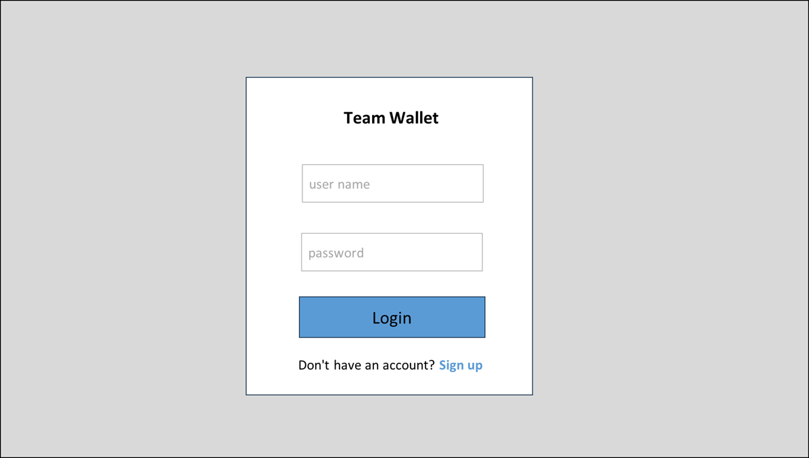

# UI仕様 - 02 ログインページ (Login)

**Version**: 1.0

## ページ概要
ユーザーがログインするページ

## ページレイアウト
**UI仕様書.xlsx | 02_ログイン** に参照  


## フォーム要素

| フィールド | 型 | 必須 | バリデーション |
|-----------|-----|------|----------|
| ユーザー名 | text | ✓ | 空白チェック |
| パスワード | password | ✓ | 空白チェック |

## デフォルトユーザー

```
ユーザー名: SUPER_admIn
パスワード: SUPER_admIn_121314
権限: Super Admin (全チーム管理)
```