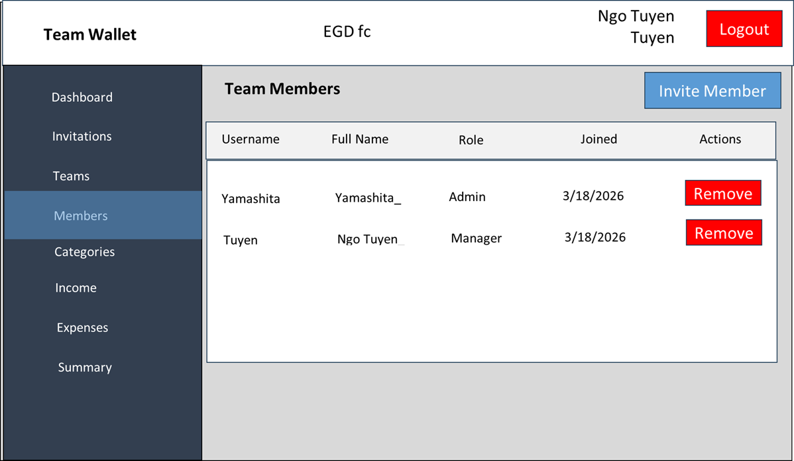
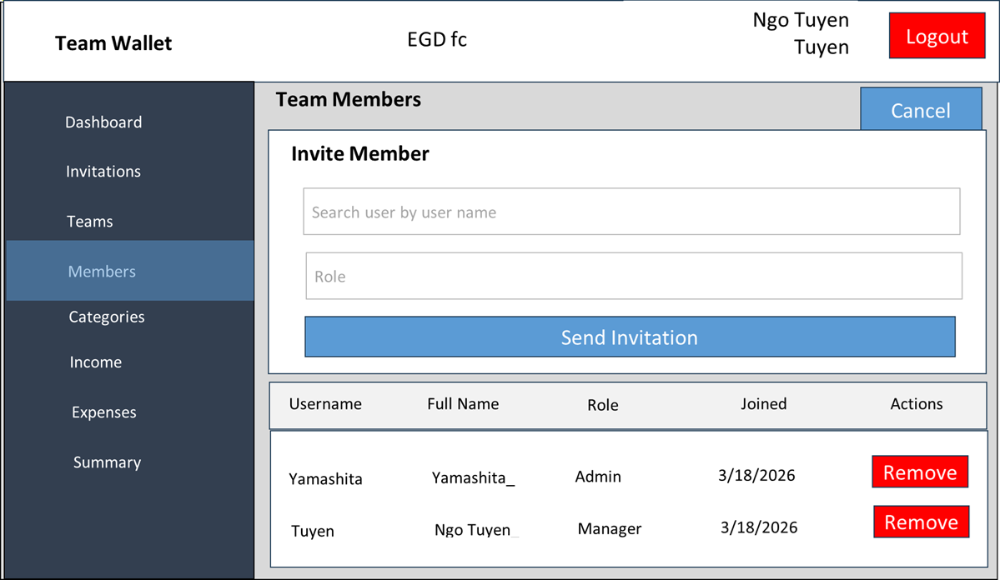

# UI仕様 - 06 メンバー管理ページ (Members)

**Version**: 1.0

## ページ概要
チームメンバーを管理し、新規メンバーを招待するページ

## メンバーテーブル
**UI仕様書.xlsx | 06_メンバー** に参照  
**メンバー一覧**  

**メンバー招待**  

## アクセス制御

| ユーザー | 権限 |
|---------|------|
| **Admin** | ロール変更・削除可能 |
| **Manager/User** | ボタン無効化 (グレー) |
| **Admin自身** | ロール変更不可 |