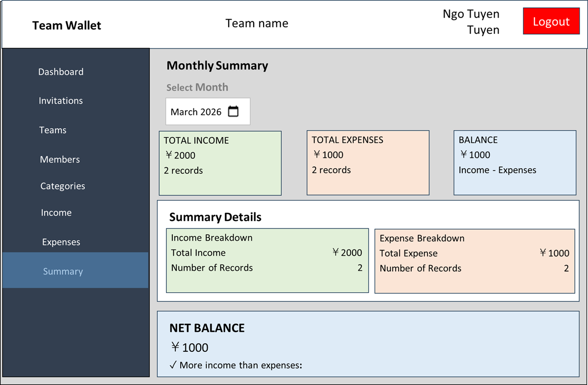

# UI仕様 - 10 月別サマリーページ (Summary)

**Version**: 1.0

## ページ概要
チームの月別収支サマリーを表示するページ

## ページレイアウト
**UI仕様書.xlsx | 10_サマリー** に参照  

## サマリー内容

- **総収入**: 該当月の全収入合計
- **総支出**: 該当月の全支出合計
- **残額**: 収入 - 支出
- **平均値**: 収入・支出ごとの平均
- **黒字/赤字判定**: 残額がプラス/マイナスを表示